# **SQL Maestro is a tool designed to help organize your workflow while troublshooting a ticket.**

Having a helper like Maestro provides a kind of "wokrstation" for organizing the important or relevant IDs, resource names, times/dates, screenshots, db tables, KB or Zendesk links, and a place to create a guide for challenging cases that require multiple steps/checks, etc.

Instead of needing to hold everything in your mind, on Clipy, on a sticky note etc., this Maestro becomes the AIO for any information about any ticket at any time. 

# UI & Features
## **Query Templates**

**This is the centerpiece of SQL Maestro**: predefined SQL query structures that use Placeholders. Reusable across tickets. Can be linked to DB tables and "Links".

This is the Query Template Pane where all the saved Query Templates are visible:

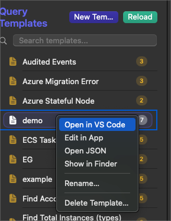


You can right-click a template and select:
1. Open in VS Code
2. Edit in App (also triggered when double-clicking the Query Template)
3. Open JSON
4. Show in Finder

If you select *#2* (Edit in App), the Query Editor (in-app) (in-app) will appear where there you can use additional functionality for customizing the queries. 
You'll also notice a few new buttons, which are explained in more detail below.

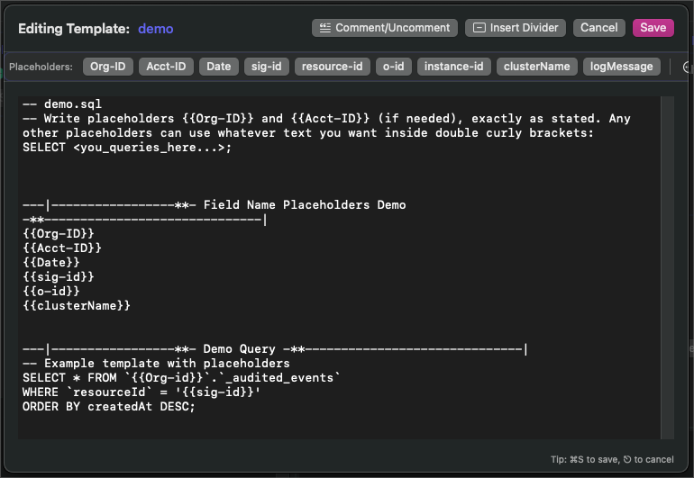

- Query Templates are not only useful to **auto-populate queries** with the custom values, but can **be used to store any notes or directions for how to troubleshoot a case**
- Also useful for Sumo Logic queries

### Example Use Case With Notes:
```
---|-----------------**- NLC -**------------------------------|
#!!!!AZURE NOTE!!!*** Look at the "state" here or in the UI and make sure the state it failed at here is what I'm setting it to in "Update Instance" DB Action

SELECT * FROM `spotinst_{{Org-ID}}`.`azure_stateful_instances`  
WHERE `ownerId` = '{{resource-id}}'   
ORDER BY `createdAt` DESC;

```

### **Placeholders**

```
--|-----------------**- Field Name Placeholders Demo -**---------|
{{Org-ID}}
{{Acct-ID}}
{{Date}}
{{sig-id}}
{{o-id}}
{{clusterName}}
```

These are variables inside Query Templates that **will be auto-replaced with actual values when you run "Populate Query"**. 

Placeholders are flexible and reusable. They let the same SQL query work across different tickets/contexts.

- Placeholders are denoted with double curly brackets and are completely customizable except for 3. See below "Note!"
- The app comes pre-built with a few standard ones already

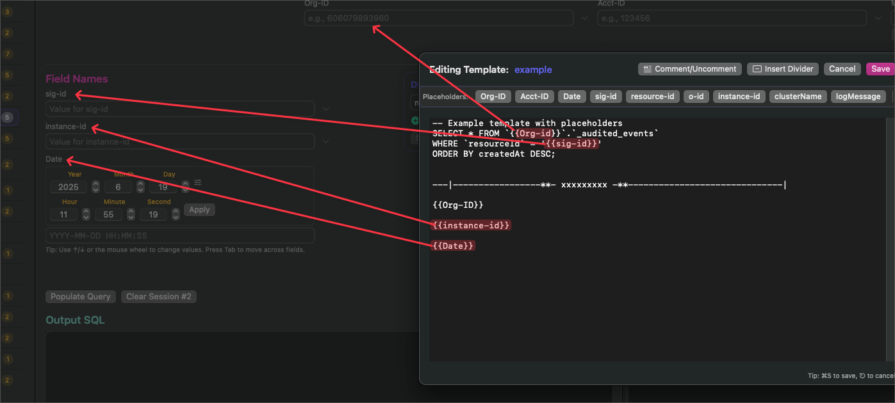

##### **Important Note!!**:
The below Placeholder **names** SHOULD NOT BE ALTERED **EVER**
- {{Org-ID}}
- {{Acct-ID}}
- {{Date}}

If you want to use these Placeholders in a query, then make sure you press the Placeholder buttons in the 'Query Editor (in-app)' window when placing them in a sql query. This will mitigate incorrect syntax issues.

Any Placeholder can be created with any syntax, but it's highly recommended to remain consistent across Query Templates.

#### Creating, Editing, and Deleting Placeholders

When a Placeholder is used in a Query Template like {{example-placeholder}}, this does not add the Placeholder button icon to the top of the Query Editor (in-app) window **IT DOES HOWEVER, create a new row under "Field Names" for you to insert values into on that Query Template.**

**Example:**
1. Freely add another custom Placeholder in a Query Template

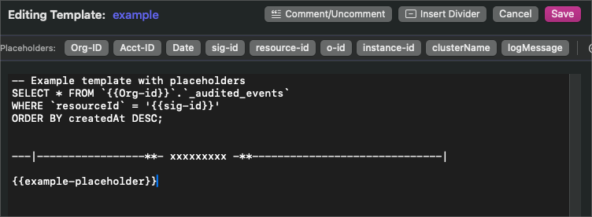

2. This will trigger a Query Template Reload, which will then show the newly created Placeholder as an additional Dynamic Field Name for that Query Template

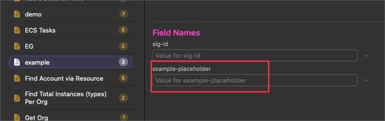

#### Placeholder Tool Bar

These Placeholder buttons are useful for "repeat Placeholders" that are used often and help keep syntax correct when writing queries. 

Pressing the Placeholder button will insert (at the cursor, or if multiple characters are highlighted) the Placeholder name along with the double curly brackets:

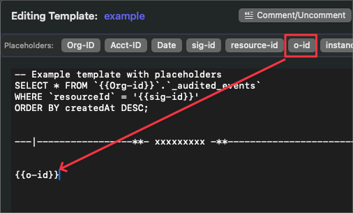


You'll notice there are buttons on this tool bar which may or may not reflect what you have in your query (note there is no entry of 'example-placeholder' on this bar, even though it exists in the Query Template):

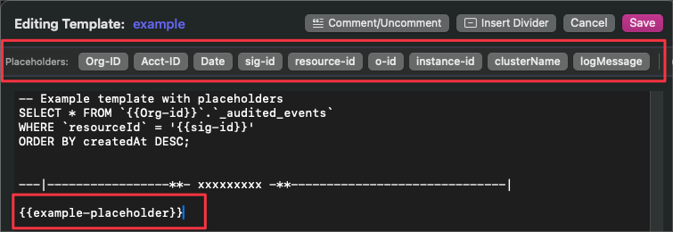


##### Adding, Editing and Deleting Placeholders

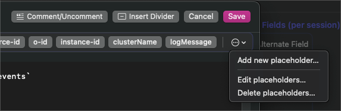

If you want to add a button for that specific Placeholder, you'll need to: 
Double click the Query Template > navigate to the edit menu at the very right of the Placeholder bar > "Add new Placeholder"

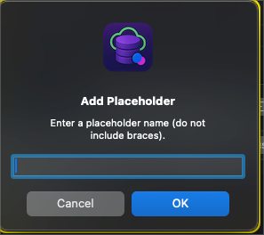

Similarly, if you want to remove a Placeholder from that bar, you can follow the same steps to find "Delete Placeholders".

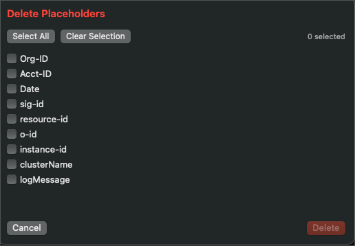

Editing the order in which those Placeholders appear on the Placeholder bar can be done by following the above and selecting "Edit Placeholders"

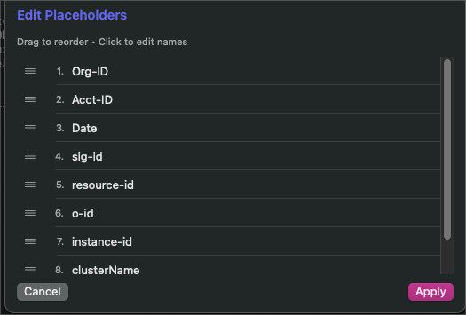

#### Top Level Buttons in Query Editor (in-app) Window (Comment/Uncomment, Insert Divider and Save)


Highlighting text in the Query Editor (in-app) and hitting "comment/uncomment" will comment out those lines of text...or uncomment them if pressed in succession

The divider button is used to help organize the queries and inserts a:
`---|-----------------**- xxxxxxxxx -**---------------------|`

Make sure to save (cmd + s) or the 'Save' button if you make any changes to the template. 

### Query Template Change History

Each time you make a change to an existing Query Template, **that change is recorded in the 'backups' folder in the Application Support for SQL Maestro**:

`'/Users/xxxxx/Library/Application Support/SQLMaestro/backups'`

This is an important feature that will allow you to retrieve any previous change you made that might have broken a query that no longer works, and you don't know what change you made, or even if you accidentally deleted a query, and you need to restore the changes. 

These files can pile up quickly if you make a lot of changes, so feel free to "prune" the garbage files that are unnecessary. 

### Query Template Backups

This will create a snapshot zip file containing **ALL** queries in your app. Useful to use before version updates that could potentially (hopefully not) delete those queries or in general, periodically run this especially if you've invested a good amount of time building them.

`/Users/xxxxx/Library/Application Support/SQLMaestro/backups/zips`

Navigate to the top menu item "Queries" > "Backup Queries"

### Query Template Indicator Per Ticket Session

In any particular ticket session, you may need to alter multiple Query Templates and add values to them. It can be a hassle trying to remember which templates you were using if you need to jump back-and-forth between them.

To make the process more friendly for navigating these use cases:

- Any change to a dynamic field in a focused Query Template triggers that query template to **jump to the top of the list and is highlighted in pink**. 
- **These changes also persist if you save and load a Ticket Session**
- **NOTE!!**: if you "Clear Session #" this will clear **all** values pasted in any Dynamic Field in **all** Query Templates.

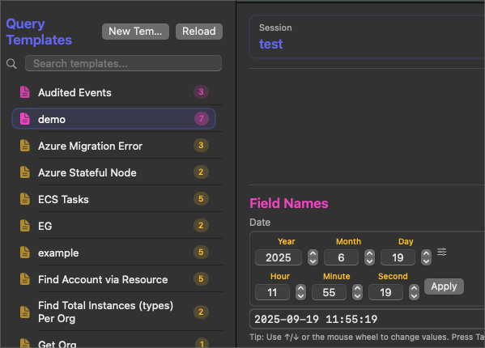

## **Dynamic Field Names**

A Placeholder field that changes depending on the Query Template and  Ticket Session.

- The "Recents" drop-down will capture values that were run with "Populate Query"

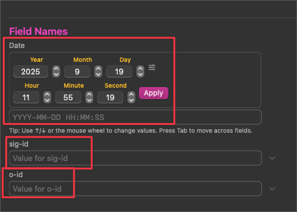

### Dynamic Fields: Pulled from Query Templates

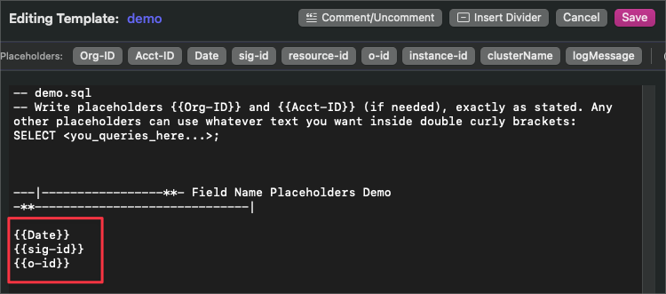

### Using "Date" Dynamic Field

This is a bit of a special field, in that it will automatically place the applied date in DB format. 

It was designed to be very user-friendly, allowing for **mouse-scroll manipulation**, **tab + arrows**, or **manual integer insertion**. 

Press "Apply" to send the calculated value to the Date Field

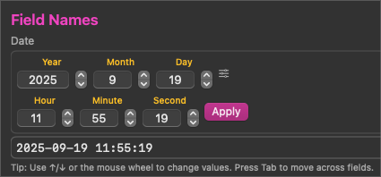

Use the mouse scroll sensitivity bar to suit the rate-of-change according to your mouse:

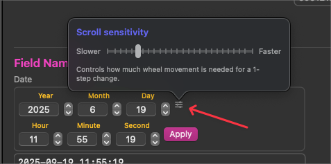


## **Static Field Name**

A field that is constant across sessions, OrgID, AcctID, and MySQL DB. The values themselves are not constant across ticket sessions; rather, the *actual fields* are not influenced by the Query Template selected. 

This is useful because each ticket will require those fields regardless of the Query Template (the scope of the ticket in question/troubleshooting case )

## **Alternate Fields**

These are fields that remain available per ticket session that hold important values but may not be useful at the moment. 

- You might be working on a ticket that requires you to remember multiple sig-ids, but only one is useful at a time
- Holding this value in the 'alternate fields' pane will allow you to quickly insert it in one of the dynamic Field Names values by:
	Double-clicking the Alternate Field row > Prompted with where you want to place that value > Places that value in the requested Dynamic Fields
- These values are recorded in the "Save Ticket Session" and are loaded back into the session if you "Load Ticket Session"

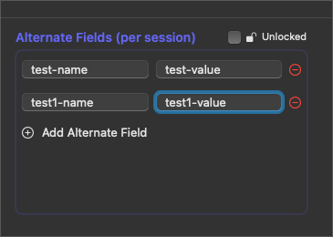

"Lock" the pane and double-click the field to prompt the overwrite to the available Field Pane values:

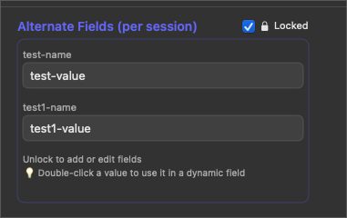

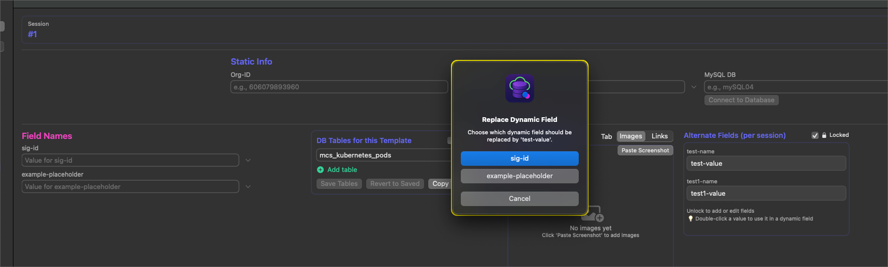

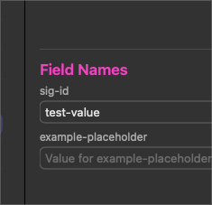

## **Ticket Session**


A container of work for a single Ticket. 
Includes:

- Query Templates used (if values were inserted)
- Placeholder Values / Dynamic Fields Values (per Query Template)
- Static Field Values
- Session Notes
- Images
- Alternate Fields

Allows the user to keep work isolated per ticket, save their work (all items above), and load their work back into a ticket session if needed.

### Saving and Loading Ticket Sessions

**Cmd+S** will save a session...:

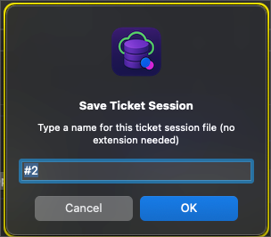

...and **Cmd+L** will load one:

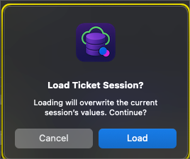

The Ticket Session you load **will overwrite the current Ticket Session** in focus. 

If you "Renamed" a Ticket Session, this will default as the file name to save:

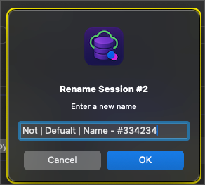

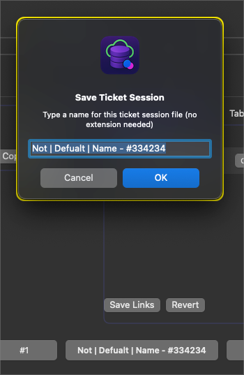

### Stored Ticket Session Location

Ticket Sessions are stored in:
`/Users/xxxxx/Library/Application Support/SQLMaestro/sessions`

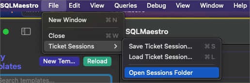

### Renaming Ticket Sessions
Each ticket session can be renamed by right-clicking the ticket session button > Rename

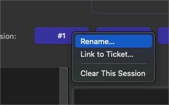

Each ticket session can be saved and will inherit the name of the Ticket Session. If the ticket session has not be manually renamed, the default is `#1, #2, #3`

***NOTE!!*** 
- It's recommended to name saved ticket sessions in the following format:
  `Name | Of | Chat Session - #ticketnumber`

### Linking Ticket Sessions With ZenDesk Tickets 

You may enter the link to the exact ZD ticket and "Save Ticket Session" to persist the associated link. 

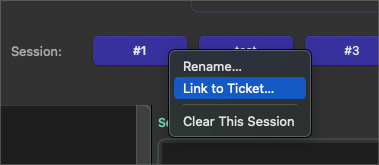

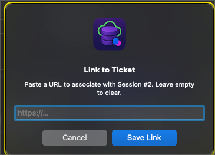

Open the link to the ticket with this icon that appears **when the relevant ticket session is in focus**:

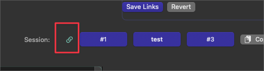

## **Copy Block Values**

Copies all values (static + dynamic + placeholders + alternates) for the current session into the clipboard, formatted for pasting elsewhere.

This will paste all the values as a "block", as the name suggests, and will look something like this:

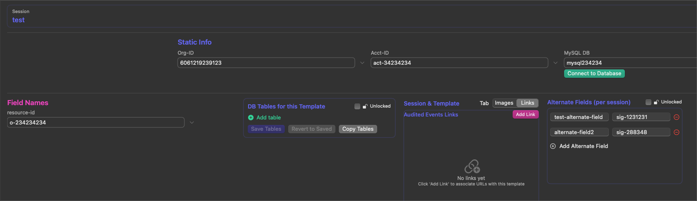

```
test
Org-ID: 6061219239123
Acct-ID: act-34234234
mysqlDb: mysql234234
resource-id: o-234234234
test-alternate-field: sig-1231231
alternate-field2: sig-288348
```

## **Copy Individual Values**

Lets you copy just one field’s value to the clipboard.

This feature does the same thing as the Copy Block Values, but instead of copying all as a block, it copies each row as a separate entry to your clipboard:

(works the same with clipy:)

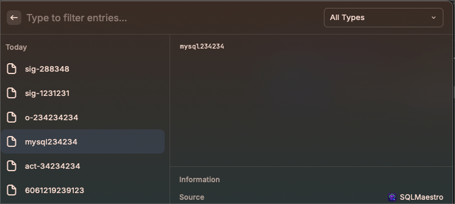

## **DB Tables**

The idea here was to use Query Templates, not according to what query you want to run, but according to what kind of ticket you are troubleshooting. 

Therefore, a Query Template might be designed to troubleshoot Azure Stateful Node, and in that case, you would want only "Azure" related DB tables to reference and easily copy and paste those table names for convenience

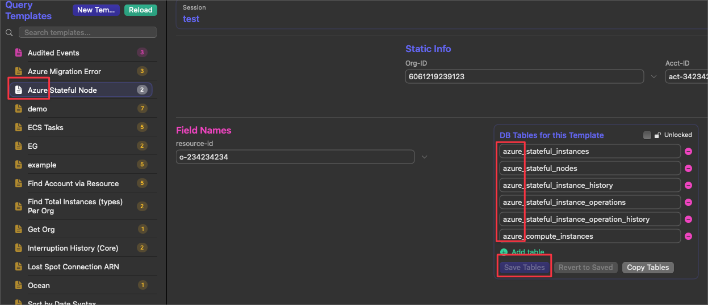

Each Query Template can be saved with certain DB tables. Just make sure to "Save" after making changes, and this will bind those queries to the Query Template "in focus". 

You can also "Lock" this pane to prevent accidental clicks or changes.

There's also a "Copy Tables" button that will copy all the tables visible to the clipboard for easy copy/paste.

## **KB Shortcuts**

There are a few helpful KB shortcuts that work in the main screen of the app.

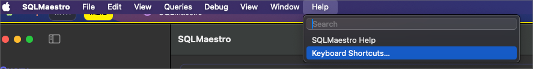


| KB Shortcut | Action                                                                                                                                                                                        |
| ----------- | --------------------------------------------------------------------------------------------------------------------------------------------------------------------------------------------- |
| Cmd + K     | Clear Session (clears all values in all fields in that session)                                                                                                                               |
| Cmd + Enter | Populates the values in Dynamic and Static Fields into the Query Template in focus                                                                                                            |
| Cmd + F     | Jumps to "Search Queries" text field                                                                                                                                                          |
| Cmd + E     | Toggle Ticket Session "Edit" or "Preview" mode                                                                                                                                                |
| Cmd + 1     | Jump to Ticket Session 1                                                                                                                                                                      |
| Cmd + 2     | Jump to Ticket Session 2                                                                                                                                                                      |
| Cmd + 3     | Jump to Ticket Session 3                                                                                                                                                                      |
| Cmd + R     | Reload Queries (used to manually reload the Query Templates if changes were made; however, this action is done automatically after saving a query template if done from the in-app editor) |
| Cmd + L     | Load Ticket Session                                                                                                                                                                           |
| Cmd + S     | Save Ticket Session                                                                                                                                                                           |

## **Images and Links**

### Saving Images

You may also add images that are currently copied to your clipboard by hitting the "Paste Images" button while focused in any Query Template.

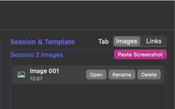

The only way to persist an image is if you save it with a Ticket Session.

**Note!!**: 

- Press cmd + left-click to show a preview of the image

### Links

Links are saved and "*linked*" **to specific Query Templates**. 

The intention here was to provide relevant links for troubleshooting a particular ticket topic and allow the user to easily access KBs, ZenDesk tickets etc.

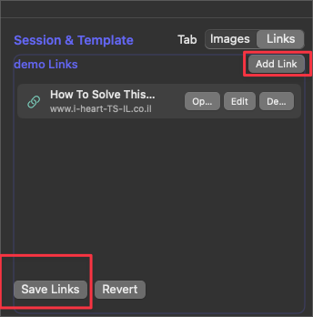

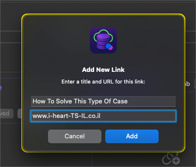

**Note!!**:
- Links will ONLY be saved if you hit the 'Save Links' button in the first image.  

## **Session Notes**

Freeform notes that are specific to a ticket session.

These notes are also saved in Ticket Sessions

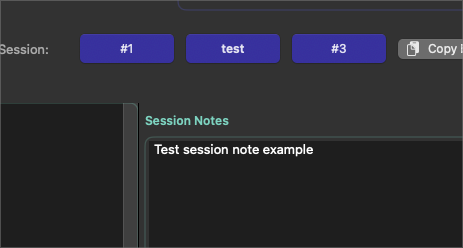

## **Troubleshooting Guide and Images**

Troubleshooting Guide notes act similarly to "Session Notes" with the difference being they are specific to a Query Template.

"Guide Images" are images that are linked to a specific Query Template. 

## **Database Connections**

The first step in troubleshooting a ticket typically involves copying the Org Id from the ticket/chat. 

Placing that value in this field:

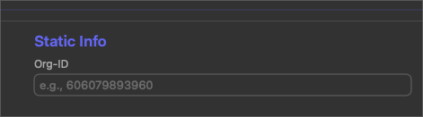

Once that value has been inserted, you can Tab out or Enter and you'll see the Company loads, along with the MySQL DB for that Org. 

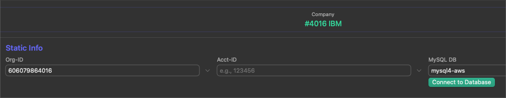

Once the "**Connect to Database**" button is green, you can click it and Querious will open that Org on its respective MySQL DB. (On first-time use, you will first be prompted to action in "Accessibility")

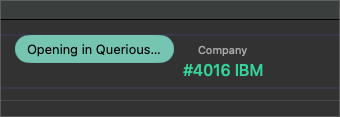

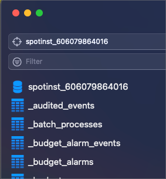

To allow this to happen, you will of course need to enter your Querious credentials from here:

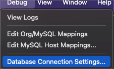

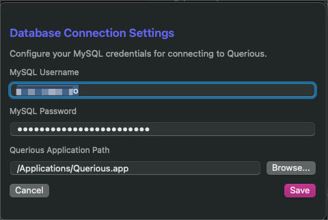

### Org and Host Mapping

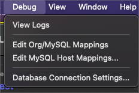

These are accessible JSON files **which house all the host names to their relevant MySQL DB as well as the Organizations to their respective MySQL DB**

**The contents of these files will need to be provided privately/internally. We'll figure out a way to make that happen.**

You will receive the two JSON files and can just copy/paste their contents in their respective files through SQL Maestro menu item which opens the JSON:

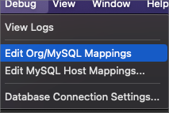

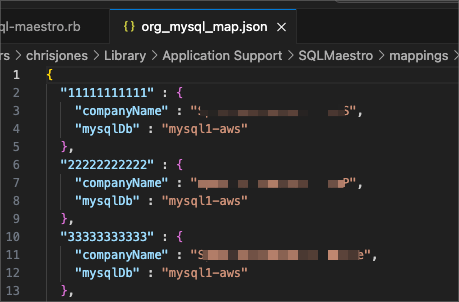

-------

# Install 

```
brew tap cxj05h/tap
brew install --cask sql-maestro
```
## Allow macOS to run the unsigned app
```
sudo xattr -rd com.apple.quarantine "/Applications/SQLMaestro.app"
```

# Upgrade

1. Go to the menu bar > SQL Maestro > About to check the version and if there's an update. 
2. Run the update through the terminal with the below or just `brew upgrade --cask sql-maestro`

```
brew update && brew upgrade --cask sql-maestro

# View current version 
brew info sql-maestro

# Update homebrew if necessary
brew update --force

# Update cask version of Maestro
brew upgrade --cask sql-maestro
```


# Uninstall

```
#!!!! AVOID THIS AFTER ALREADY CUSTOMIZING YOUR MAESTRO
#!!!! BACKUP ALL SESSIONS & QUERIES BEFORE UNINSTALL

brew uninstall --cask sql-maestro
brew cleanup --prune=all
brew doctor
```
