# **SQL Maestro is a tool designed to help organize your workflow while troubleshooting a ticket.**

Having a helper like Maestro provides a kind of "wokrstation" for organizing the important or relevant IDs, resource names, times/dates, screenshots, db tables, KB or Zendesk links, and a place to create a guide for challenging cases that require multiple steps/checks, etc.

Instead of needing to hold everything in your mind, on Clipy, on a sticky note, etc., this Maestro becomes the AIO for any information about any ticket at any time. 

## Getting Started: Import Org and Host Files

- In order to connect to Querious DBs to the right database and MySQL server, you need to have the Organization IDs and their mapped Host Names.
- This requires importing two files I will provide you upon installing the software
- These files are `org_mysql_map.json` ("Import Orgs") and `mysql_hosts_map.json` ("Import Hosts")
- After downloading the files I provide, select the file to import with its corresponding import button. Both need to be imported.

 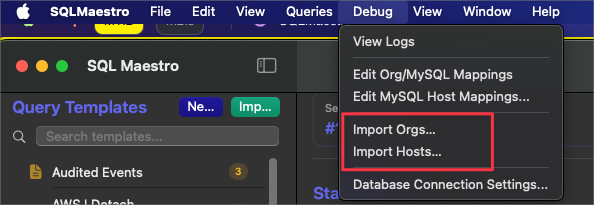


# UI & Features


## Quick Begin Capture (Org/Acct + ad-hoc IDs)

Use the new **Begin** button in the Static Info header – or press **⌃⇧B** from anywhere on macOS – to pop open a lightweight capture window without picking a query template first. Paste the customer’s **Org ID** and **Account ID** into the first two fields, press **Tab** to move between them. **To add additional rows for Alternate Fields** for other identifiers, hit **Cmd+Return**. When you’re done, press **Enter** to **Save**.

This feature was added to make it easier to record important resource information before determining which troubleshooting route to take. That's why the Alternate Fields are Query Template neutral, meaning they persist across Query Template changes. Read more about Alternate Fields below. 

You can use the "Auto Populate" button which will take the last 3 clipboard entries and look for the Org ID, the Account ID and place them in their respective fields on "save", while the other entry that is not either Org or Act will be added to the Alternate Fields Pane--this can be anything you captured while receiving a ticket such as the Resource ID.

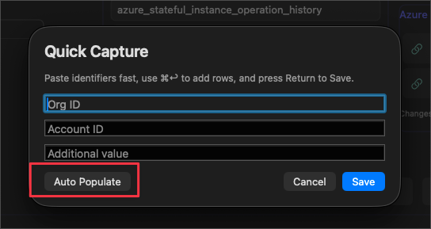

Saving immediately fills the current session’s Org/Acct static fields and drops every additional value into the Alternate Fields list as unnamed rows you can label later. All captured values stay with the session, so they travel with you no matter which query template you decide to load next.

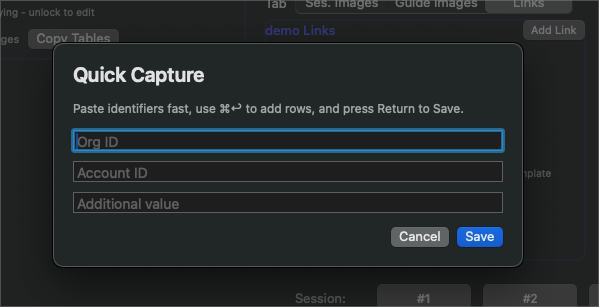

Fill in the data you want to be saved:

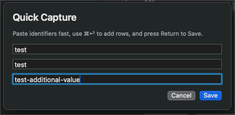

The "Additional Value" values will populate the Alternate Field pane with however many you added (no whitespace allowed here):

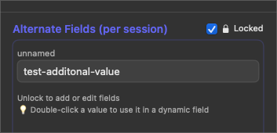

## **Query Templates**

**This is the centerpiece of SQL Maestro**: predefined SQL query structures that use Placeholders. Reusable across tickets. Can be linked to DB tables and "Links".

This is the Query Template Pane where all the saved Query Templates are visible:


You can right-click a template and select:
1. Open in VS Code
2. Edit in App (also triggered when double-clicking the Query Template)
3. Open JSON
4. Show in Finder

If you select *#2* (Edit in App), the Query Editor (in-app) (in-app) will appear where there you can use additional functionality for customizing the queries. 
You'll also notice a few new buttons, which are explained in more detail below.


- Query Templates are not only useful to **auto-populate queries** with the custom values, but can **be used to store any notes or directions for how to troubleshoot a case**
- Also useful for Sumo Logic queries

### Example Use Case With Notes:
```
---|-----------------**- NLC -**------------------------------|
#!!!!AZURE NOTE!!!*** Look at the "state" here or in the UI and make sure the state it failed at here is what I'm setting it to in "Update Instance" DB Action

SELECT * FROM `spotinst_{{Org-ID}}`.`azure_stateful_instances`  
WHERE `ownerId` = '{{resource-id}}'   
ORDER BY `createdAt` DESC;

```

### **Placeholders**

```
--|-----------------**- Field Name Placeholders Demo -**---------|
{{Org-ID}}
{{Acct-ID}}
{{Date}}
{{sig-id}}
{{o-id}}
{{clusterName}}
```

These are variables inside Query Templates that **will be auto-replaced with actual values when you run "Populate Query"**. 

Placeholders are flexible and reusable. They let the same SQL query work across different tickets/contexts.

- Placeholders are denoted with double curly brackets and are completely customizable except for 3. See below "Note!"
- The app comes pre-built with a few standard ones already


##### **Important Note!!**:
The below Placeholder **names** SHOULD NOT BE ALTERED **EVER**
- {{Org-ID}}
- {{Acct-ID}}
- {{Date}}

If you want to use these Placeholders in a query, then make sure you press the Placeholder buttons in the 'Query Editor (in-app)' window when placing them in a sql query. This will mitigate incorrect syntax issues.

Any Placeholder can be created with any syntax, but it's highly recommended to remain consistent across Query Templates.

#### Creating, Editing, and Deleting Placeholders

When a Placeholder is used in a Query Template like {{example-placeholder}}, this does not add the Placeholder button icon to the top of the Query Editor (in-app) window **IT DOES HOWEVER, create a new row under "Field Names" for you to insert values into on that Query Template.**

**Example:**
1. Freely add another custom Placeholder in a Query Template


2. This will trigger a Query Template Reload, which will then show the newly created Placeholder as an additional Dynamic Field Name for that Query Template


#### Placeholder Tool Bar

These Placeholder buttons are useful for "repeat Placeholders" that are used often and help keep syntax correct when writing queries. 

Pressing the Placeholder button will insert (at the cursor, or if multiple characters are highlighted) the Placeholder name along with the double curly brackets:


You'll notice there are buttons on this tool bar which may or may not reflect what you have in your query (note there is no entry of 'example-placeholder' on this bar, even though it exists in the Query Template):


##### Adding, Editing and Deleting Placeholders


If you want to add a button for that specific Placeholder, you'll need to: 
Double click the Query Template > navigate to the edit menu at the very right of the Placeholder bar > "Add new Placeholder"


Similarly, if you want to remove a Placeholder from that bar, you can follow the same steps to find "Delete Placeholders".


Editing the order in which those Placeholders appear on the Placeholder bar can be done by following the above and selecting "Edit Placeholders"


#### Top Level Buttons in Query Editor (in-app) Window (Comment/Uncomment, Insert Divider and Save)


Highlighting text in the Query Editor (in-app) and hitting "comment/uncomment" will comment out those lines of text...or uncomment them if pressed in succession

The divider button is used to help organize the queries and inserts a:
`---|-----------------**- xxxxxxxxx -**---------------------|`

Make sure to save (cmd + s) or the 'Save' button if you make any changes to the template. 

### Query Template Tagging

Templates can now carry one or more tags saved in separate .tags.json sidecar files. Tags are normalized (lowercase, hyphen-separated) automatically, and persist across renames and reloads.

- **Adding Tags** – In the templates sidebar, right-click a template and choose “Add Tags.” Enter comma-separated names (no need to type #). Each confirmed tag appears as a colored chip; remove chips by clicking the x. Press **Save** to persist or **Cancel** to discard.

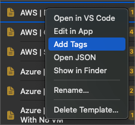

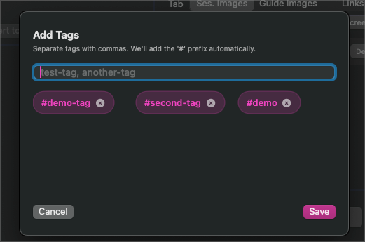

- **Viewing Tags** – When a template is active, its tags appear beneath the “Active Template” label. “Tags:” uses the standard grey caption style, while each `#tag` is pink and slightly larger for readability.

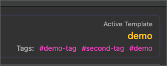

- **Tag Explorer** – Click any tag beside the active template (or from search results) to open a modal listing every template that shares that tag. Selecting a row loads that template immediately.

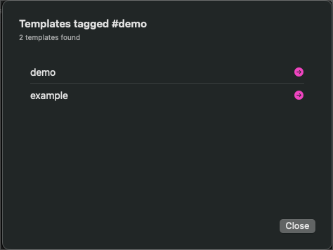

- **Searching by Tag** – Typing `#` followed by text in the template search box switches the sidebar into tag-search mode. The results list shows matching tags, along with how many templates carry each one. Click a result to open the tag explorer modal.

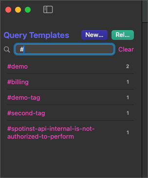

- **Cleanup** – Deleting a template removes its tag sidecar file automatically; renaming a template migrates its tags to the new filename.


#### Tag Search (cmd+shift+t)
Quickly find and filter query templates by tag Press cmd+shift+t to open the tag search dialog. This shows all tags used across your query templates with a count of how many templates use each tag. How to search:
- Start typing to filter tags by name
- Results update in real-time as you type
- Each tag shows the number of templates that use it

**Navigation**
- Use arrow keys to navigate through filtered tags
- Press Enter to select a tag and filter your templates by that tag
- Press Escape to close the dialog without selecting
- This is useful when you have many templates and want to quickly find all templates related to a specific category or topic.


### Importing / Exporting Query Templates

- You can share templates with others using this tool.
- Each template is actually a package of a few file,s so it's not as simple as just "click-and-drag" to the receiving party
- "Export" will zip these files and it's this zip folder you share.

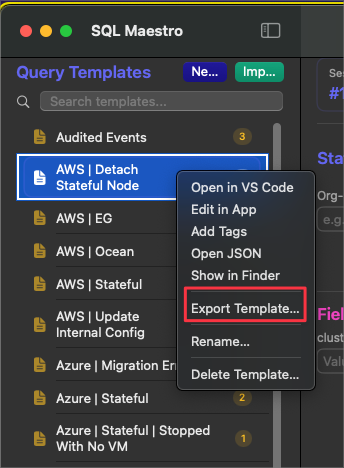

- "Import" button/menu item will take the above zipped folder and will unzip it into the correct place, adding the query to your personal directory

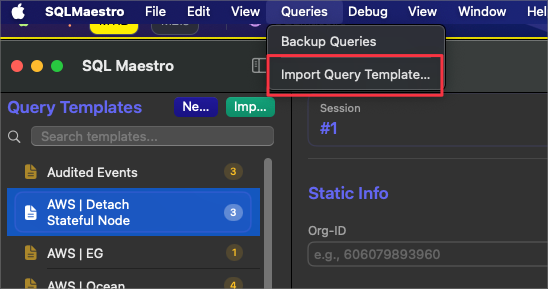

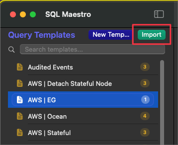

### Query Template Change History

Each time you make a change to an existing Query Template, **those changes are recorded in the `query_history_checkpoints` folder in the Application Support for SQL Maestro**:

`/Users/<username>/Library/Application Support/SQLMaestro/backups/query_history_checkpoints`

This is an important feature that allows you to retrieve any previous change you made that might have broken a query that no longer works, you accidently deleted a Guide Image or Link or removed a tag on accident. If you're unsure of the change or if you accidentally deleted a query, you can use this feature to restore the changes. The query history stores everything associated with a query template, such as links, guide images, guide notes, tags, and SQL templates. 

Automatic backups are created after making a change to an active Query Template and reach a "checkpoint" action:
- Populate query
- Load another template
- Switch ticket sessions
- Clear session
- Copy block/individual values
- Connect to database
- Quit application

**Features:**
- Each backup is a complete snapshot including SQL text, links, guide notes, images, tags, and metadata
- Backups are throttled (1 second minimum between saves) to prevent duplicates
- Automatically pruned after 30 days
- Naming format: templatename-YYYYMMDD_HHmmss.zip

#### Restoring Templates
Restore Single Template from History

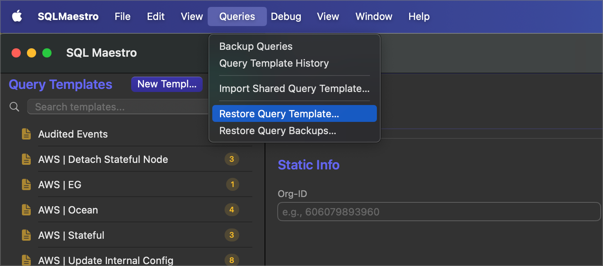

Restore a specific template from its automatic checkpoint history.

**Steps:**
1. Menu: Queries > Restore Query Template…
2. Select the checkpoint zip file you want to restore
3. The template will be restored with all its assets (SQL, links, notes, images, etc.)

Note: This restores a single template without affecting others. 

### Query Template Backups (Full Backup)

This will create a snapshot zip file containing **ALL** queries in your app. Each backed-up query is its own zip file inside the parent zip.

Useful to use before version updates that could potentially (hopefully not) delete those queries, or in general, periodically run this, especially if you've invested a good amount of time building them.

`/Users/<username>/Library/Application Support/SQLMaestro/backups/query_template_backups`

Navigate to the top menu item "Queries" > "Backup Queries"

- Naming format: templates-YYYYMMDD_HHmmss.zip

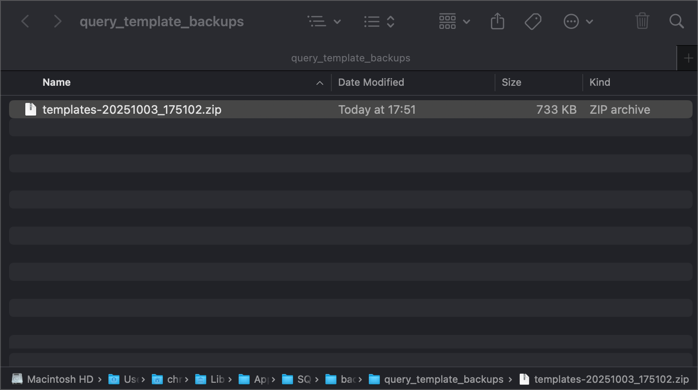

#### Restore All Templates from Full Backup

Restore your entire template library from a manual full backup.

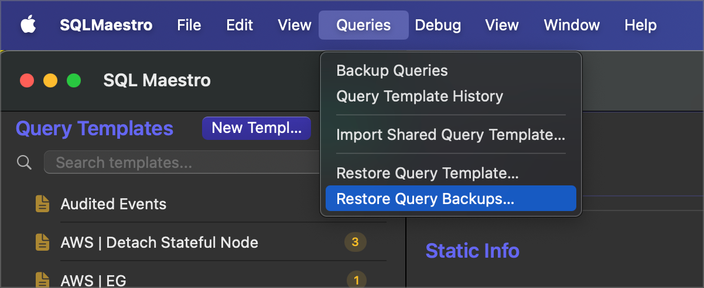

Steps:
1. Menu: Queries > Restore Query Backups…
2. Select the full backup archive (templates-*.zip)
3. ⚠️ Warning: This is a destructive operation that replaces all current templates. 
4. All templates will be restored from the backup

**File Structure**

```
~.../Library/Application Support/SQLMaestro/
└── backups/
  ├── query_history_checkpoints/    # Automatic template history
  │   ├── example-20251003_143022.zip
  │   ├── demo-20251003_145530.zip
  │   └── ...
  └── query_template_backups/        # Manual full backups
	  ├── templates-20251003_150000.zip
	  └── ...
```

**Best Practices**
- Regular Full Backups: Create manual full backups before major changes or periodically for peace of mind
- History Checkpoints: Rely on automatic checkpoints during normal work - they happen automatically at key actions
- 30-Day Retention: History checkpoints are automatically cleaned up after 30 days, so restore older versions before they expire if needed


### Query Template Indicator Per Ticket Session

In any particular ticket session, you may need to alter multiple Query Templates and add values to them. It can be a hassle trying to remember which templates you were using if you need to jump back-and-forth between them.

To make the process more friendly for navigating these use cases:

- Any change to a dynamic field in a focused Query Template triggers that query template to **jump to the top of the list and is highlighted in pink**. 
- **These changes also persist if you save and load a Ticket Session**
- **NOTE!!**: if you "Clear Session #" this will clear **all** values pasted in any Dynamic Field in **all** Query Templates.


## **Dynamic Field Names**

A Placeholder field that changes depending on the Query Template and  Ticket Session.

- The "Recents" drop-down will capture values that were run with "Populate Query"


### Dynamic Fields: Pulled from Query Templates


### Using "Date" Dynamic Field

This is a bit of a special field, in that it will automatically place the applied date in DB format. 

It was designed to be very user-friendly, allowing for **mouse-scroll manipulation**, **tab + arrows**, or **manual integer insertion**. 

Press "Apply" to send the calculated value to the Date Field


Use the mouse scroll sensitivity bar to suit the rate-of-change according to your mouse:


## **Static Field Name**

A field that is constant across sessions, OrgID, AcctID, and MySQL DB. The values themselves are not constant across ticket sessions; rather, the *actual fields* are not influenced by the Query Template selected. 

This is useful because each ticket will require those fields regardless of the Query Template (the scope of the ticket in question/troubleshooting case )

## **Alternate Fields**

These are fields that remain available per ticket session that hold important values but may not be useful at the moment. 

- You might be working on a ticket that requires you to remember multiple sig-ids, but only one is useful at a time
- Holding this value in the 'alternate fields' pane will allow you to quickly insert it in one of the dynamic Field Names values by:
	Double-clicking the Alternate Field row > Prompted with where you want to place that value > Places that value in the requested Dynamic Fields
- These values are recorded in the "Save Ticket Session" and are loaded back into the session if you "Load Ticket Session"


"Lock" the pane and double-click the field to prompt the overwrite to the available Field Pane values:


## Sidebar Toggle

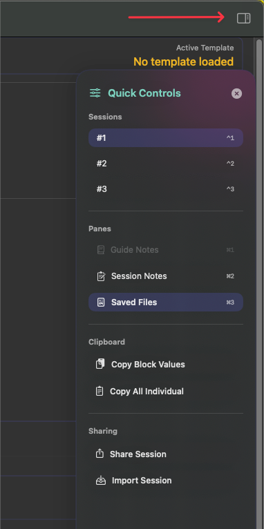

The sidebar provides quick access to three main panels containing project and session information:

**Panels**

- Guide Notes - Project documentation and guides
- Session Notes - Notes for the current ticket session
- Saved Files - Saved query templates and session files
- Ticket Session 1
- Ticket Session 2
- Ticket Session 3

Each panel can be accessed via the Sidebar or KB shortcuts:

**Keyboard Shortcuts**
- Cmd+1 - Toggle Guide Notes
- Cmd+2 - Toggle Session Notes
- Cmd+3 - Toggle Saved Files
- Ctrl+1 - Go to ticket session 1
- Ctrl+2 - Go to ticket session 2
- Ctrl+3 - Go to ticket session 3

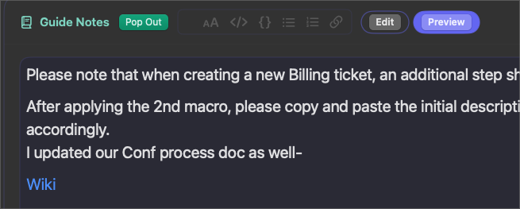

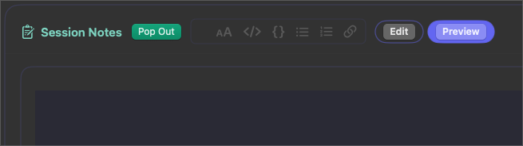


**Panel Features**
- Panels open inline by default in the main window
- Each panel can be popped out into a separate window 
- Panels include a [an almost] complete markdown toolbar for formatting, including `inline code` , ``` code block ```, **bold** , _italics_ , [Links](google.com) ,  bullets / numbering and Headers

---
  
  ### **Share & Import Sessions**

  The share and import feature allows you to save and transfer complete session states, including query templates, dynamic field values, and copy block values.

  **Sharing a Session**

  1. Click the Share button in the title bar
  2. A JSON file is generated containing:
    - Active query template(s)
    - All dynamic field values
    - Copy block values
    - Session notes
    - Company and session metadata
  3. If multiple Query Templates are used in a session, their Guide Notes will stack with clear separation.
  4. The imported session will appear as a complete stack under one newly imported Query Template marked with "(shared)" prepended to the Query Template name. **Sharing Query Templates specifically should be done via individual file sharing.** 
  5. Save the file to share with others or for backup purposes

  **Importing a Session**

  1. Click the Import button in the title bar
  2. Select a previously saved session JSON file
  3. The session is restored with all its data

  **Multiple Query Templates**

  When a session contains multiple query templates:
  - All templates are preserved in the exported JSON
  - On import, all templates are restored to their respective ticket sessions
  - Template relationships and order are maintained

  **Copy Block Values**

  Copy block values are handled as follows:
  - On Export: All copy block values (CBV) from the session are included in the JSON
  - On Import: Copy block values are restored to the Alternate Fields Pane (AFP)
  - Locked values remain locked
  - All CBV maintain their associations with their respective dynamic fields

  Use Cases

  - Collaboration: Share complex tickets with team members
  - Templates: Create reusable session configurations
  - Backup: Save work in progress for later restoration
  - Documentation: Archive example sessions with real field values

## **Ticket Session**


A container of work for a single Ticket. 
Includes:

- Query Templates used (if values were inserted)
- Placeholder Values / Dynamic Fields Values (per Query Template)
- Static Field Values
- Session Notes
- Images
- Alternate Fields

Allows the user to keep work isolated per ticket, save their work (all items above), and load their work back into a ticket session if needed.

### Saving and Loading Ticket Sessions

**Cmd+S** will save a session...:


...and **Cmd+L** will load one:


The Ticket Session you load **will overwrite the current Ticket Session** in focus. 

If you "Renamed" a Ticket Session, this will default as the file name to save:


### Stored Ticket Session Location

Ticket Sessions are stored in:
`/Users/xxxxx/Library/Application Support/SQLMaestro/sessions`


### Renaming Ticket Sessions
Each ticket session can be renamed by right-clicking the ticket session button > Rename


Each ticket session can be saved and will inherit the name of the Ticket Session. If the ticket session has not be manually renamed, the default is `#1, #2, #3`

***NOTE!!*** 
- It's recommended to name saved ticket sessions in the following format:
  `Name | Of | Chat Session - #ticketnumber`

### Linking Ticket Sessions With ZenDesk Tickets 

You may enter the link to the exact ZD ticket and "Save Ticket Session" to persist the associated link. 


Open the link to the ticket with this icon that appears **when the relevant ticket session is in focus**:


## **Copy Block Values**

Copies all values (static + dynamic + placeholders + alternates) for the current session into the clipboard, formatted for pasting elsewhere.

This will paste all the values as a "block", as the name suggests, and will look something like this:


```
test
Org-ID: 6061219239123
Acct-ID: act-34234234
mysqlDb: mysql234234
resource-id: o-234234234
test-alternate-field: sig-1231231
alternate-field2: sig-288348
```

## **Copy Individual Values**

Lets you copy just one field’s value to the clipboard.

This feature does the same thing as the Copy Block Values, but instead of copying all as a block, it copies each row as a separate entry to your clipboard:

(works the same with clipy:)


## **DB Tables**

The idea here was to use Query Templates, not according to what query you want to run, but according to what kind of ticket you are troubleshooting. 

Therefore, a Query Template might be designed to troubleshoot Azure Stateful Node, and in that case, you would want only "Azure" related DB tables to reference and easily copy and paste those table names for convenience


Each Query Template can be saved with certain DB tables. Just make sure to "Save" after making changes, and this will bind those queries to the Query Template "in focus". 

You can also "Lock" this pane to prevent accidental clicks or changes.

There's also a "Copy Tables" button that will copy all the tables visible to the clipboard for easy copy/paste.

## **KB Shortcuts**

There are a few helpful KB shortcuts that work in the main screen of the app.


| KB Shortcut | Action                                                                                                                                                                                        |
| ----------- | --------------------------------------------------------------------------------------------------------------------------------------------------------------------------------------------- |
| Cmd + Shift + K     | Clear Session (clears all values in all fields in that session)           																											  |
| Ctl + Shift + B | Global shortcut for "Quick Capture"
| Cmd + Enter | Populates the values in Dynamic and Static Fields into the Query Template in focus/ Saves Dynamic Field values into field "recents"                                                                                                           |
| Cmd + Left-Click | Click on an image in the "Session & Template" pane--either Ses. Images or Guide Images, or click the hyperlink in Guide Notes or in Session Notes where the image resides in those notes to view the image in "preview" mode |
| Cmd + F     | Jumps to "Search Queries" text field                                                                                                                                                          |
| Cmd + Shift + F    | Guide Notes keyword search                                                                                                                                                                         |
| Cmd + T     | Toggle Sidebar                                                                                                                                                                                |
| Cmd + Shift + T     | Tag Search                                                                                                                                                                                |
| Cmd + E     | Toggle Ticket Session "Edit" or "Preview" mode  / Toggle locked panes                                                                                                                         |
| Cmd + K     | Insert link into note                                                                                                                                                                         |
| Cmd + N    | Create new tab of an addtional three ticket sessions.                                                                                                                                           |
| Ctrl + 1     | Jump to Ticket Session 1                                                                                                                                                                      |
| Ctrl + 2     | Jump to Ticket Session 2                                                                                                                                                                      |
| Ctrl + 3     | Jump to Ticket Session 3                                                                                                                                                                      |
| Cmd + 1     | Jump to Guide Notes                                                                                                                                                                    |
| Cmd + 2     | Jump to Session Notes                                                                                                                                                                    |
| Cmd + 3     | Jump to Saved JSON Files                                                                                                                                                                   |
| Cmd + R     | Reload Queries (used to manually reload the Query Templates if changes were made; however, this action is done automatically after saving a query template if done from the in-app editor)    |
| Cmd + L     | Load Ticket Session                                                                                                                                                                           |
| Cmd + S     | Save Ticket Session                                                                                                                                                                           |

## **Images and Links**

### Saving Images

You can save images to either the Troubleshooting Guide or the Session (Ses) Images in the Session & Template pane, either by using the button "Paste" (per tab: Guide Images/Ses Images) or via the notes text editor for each. See more about that below. 

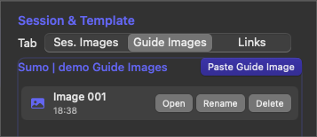

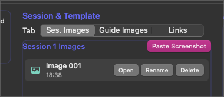

**Note!!**: 

- Press cmd + left-click to show a preview of the image
- The only way to persist an image is if you **save** it with a Ticket Session.

### Links

Links are saved and "*linked*" **to specific Query Templates**. 

The intention here was to provide relevant links for troubleshooting a particular ticket topic and allow the user to easily access KBs, ZenDesk tickets etc.


**Note!!**:
- Links will ONLY be saved if you hit the 'Save Links' button in the first image.  

## **Session Notes and Images**

Freeform notes that are specific to a ticket session.

These notes are also saved in Ticket Sessions

Drag an image or paste an image into this text field, and it will automatically be added to "Ses Images". This will create a hyperlink to the locally saved image location, so you can cmd+click the image link to open or preview the image. You can rename the image link name from the "Session & Template" pane > "Rename" and the hyperlink name will update as well. 

Deleting the image from the "Session and Template" pane will remove it from the text editor.

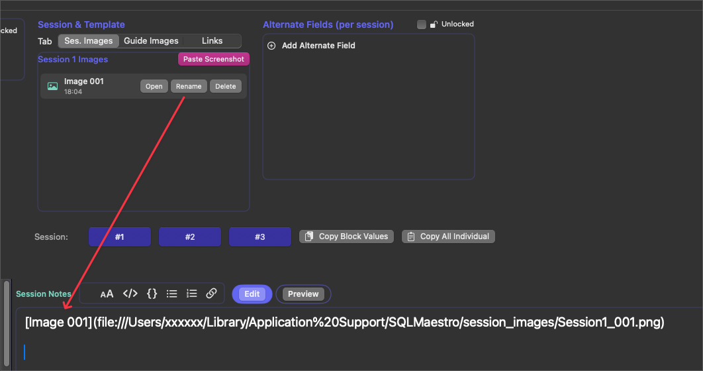


## **Troubleshooting Guide Notes and Images**

Troubleshooting Guide notes act similarly to "Session Notes" with the difference being they are specific to a Query Template.

"Guide Images" are images that are linked to a specific Query Template. 

Drag an image or paste an image into this text field and it will automatically be added to "Guide Images". This will create a hyperlink to the locally saved image location, so you can cmd+click the image link to open or preview the image. You can rename the image link name from the "Session & Template" pane > "Rename" and the hyperlink name will update as well.  

Deleting the image from the "Session and Template" pane will remove it from the text editor.

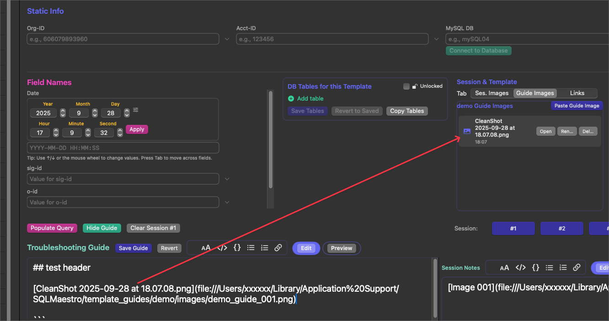

### Guide Notes Search (cmd+shift+f)

Search across all guide notes in all query templates Press cmd+shift+f to open the guide notes search dialog. This searches through the guide notes of every query template in your database, not just the current session. How to search:
- Type keywords separated by spaces - by default, all keywords must be found (AND logic)
- Add "or" between keywords to find templates containing any keyword: cpu or memory
- Add "and" between keywords for explicit AND logic: cpu and memory
- Partial word matching works automatically: typing "save" will find "saved", "savings", etc.
- Search is case-insensitive

**Results and navigation:**
- Results show the query template name and number of matches
- Use arrow keys to navigate through results
- Selected results show preview snippets with one line of context before and after each match
- Press Enter to open the selected template's guide notes with the keyword highlighted (yellow flash)

Examples:
vcpu - finds all templates with "vcpu" in guide notes
ocean cluster - finds templates containing both words
cpu or memory - finds templates with either "cpu" or "memory"
saving - matches "save", "saved", "savings", etc.


## Working with Embedded Images

SQLMaestro lets you capture screenshots directly into both the Session Notes and Troubleshooting Guide editors. The app stores the files immediately and keeps them organized so you can rename, preview,
and open them whenever you need.

### Pasting Images

- Switch either editor into Edit mode and paste (⌘V) an image or drag a file in.
- The image is saved right away:
  - Session Notes attachments land in the Session Images tab for the current session.
  - Troubleshooting Guide attachments land in the Guide Images tab for the selected template.
- A Markdown link is inserted at the cursor so the screenshot appears in Preview mode without extra steps.

### Previewing from the Markdown Pane

- After pasting, flip the editor into Preview mode.
- ⌘-click any embedded image link to open the built-in preview sheet instantly.
- Click the link _without_ the 'cmd' button and the image will open in the default image viewer app.

### Renaming Images

- Each image row includes a Rename button. Enter a custom name to replace the generated filename.
- Once renamed, the new label is reflected everywhere the image appears, including existing Markdown links.

These tools make it easy to capture, organize, and reuse visual notes while keeping your session and guide documentation in sync.


## Saved JSON Files

- This pane is used to hold relevant JSON files per ticket session
- You can add multiple files per ticket session
- Search the JSON with the "find" field
- View JSON in "structure" flow form and search for keywords

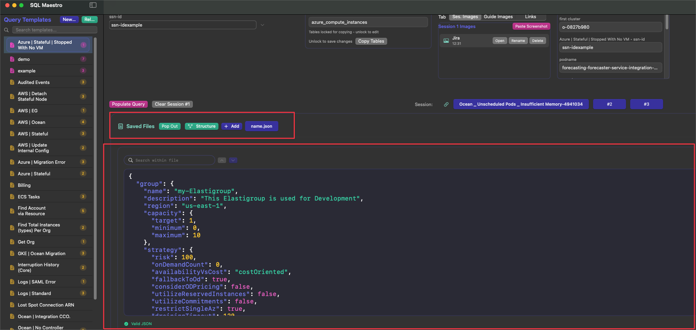

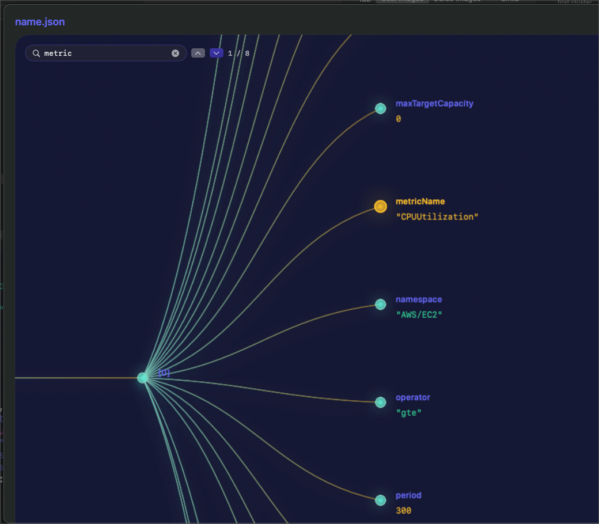


## **Database Connections**

The first step in troubleshooting a ticket typically involves copying the Org Id from the ticket/chat. 

Placing that value in this field:


Once that value has been inserted, you can Tab out or Enter and you'll see the Company loads, along with the MySQL DB for that Org. 


Once the "**Connect to Database**" button is green, you can click it and Querious will open that Org on its respective MySQL DB. (On first-time use, you will first be prompted to action in "Accessibility")


To allow this to happen, you will of course need to enter your Querious credentials from here:


### Org and Host Mapping


These are accessible JSON files **which house all the host names to their relevant MySQL DB as well as the Organizations to their respective MySQL DB**

**The contents of these files will need to be provided privately/internally. We'll figure out a way to make that happen.**

You will receive the two JSON files and can just copy/paste their contents in their respective files through SQL Maestro menu item which opens the JSON:


-------

# Install 

```
brew tap cxj05h/tap
brew install --cask sql-maestro
```
## Allow macOS to run the unsigned app
```
sudo xattr -rd com.apple.quarantine "/Applications/SQLMaestro.app"
```

# Upgrade

1. Go to the menu bar > SQL Maestro > About to check the version and if there's an update. 
2. Run the update through the terminal with the below or just `brew upgrade --cask sql-maestro`

```
brew update && brew upgrade --cask sql-maestro

# View current version 
brew info sql-maestro

# Update homebrew if necessary
brew update --force

# Update cask version of Maestro
brew upgrade --cask sql-maestro
```


# Uninstall

```
#!!!! AVOID THIS AFTER ALREADY CUSTOMIZING YOUR MAESTRO
#!!!! BACKUP ALL SESSIONS & QUERIES BEFORE UNINSTALL

brew uninstall --cask sql-maestro
brew cleanup --prune=all
brew doctor
```
